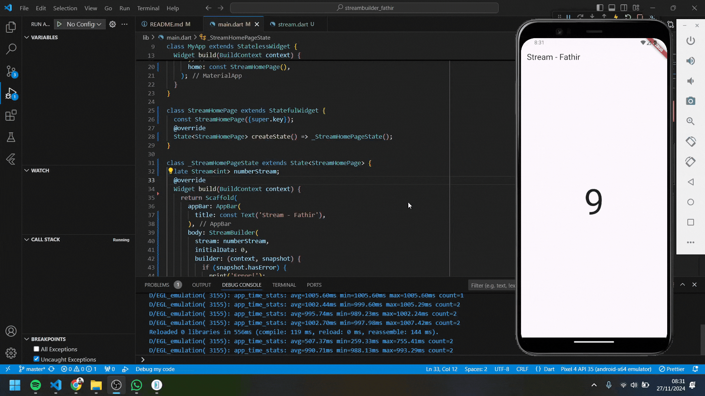

Nama    : Ahmed Fathir Syafaat

Kelas   : TI - 3H

NIM     : 2241720083

# #12 | Lanjutan State Management dengan Streams

## Praktikum 6: StreamBuilder
### Soal 12
Jelaskan maksud kode pada langkah 3 dan 7 !
> - Langkah 3: Membuat stream yang memancarkan angka acak antara 0 hingga 9 setiap detik menggunakan Stream.periodic.
> - Langkah 7: Menggunakan StreamBuilder untuk membangun UI yang memperbarui angka acak terbaru secara otomatis berdasarkan data dari numberStream.

Capture hasil praktikum Anda berupa GIF dan lampirkan di README.
